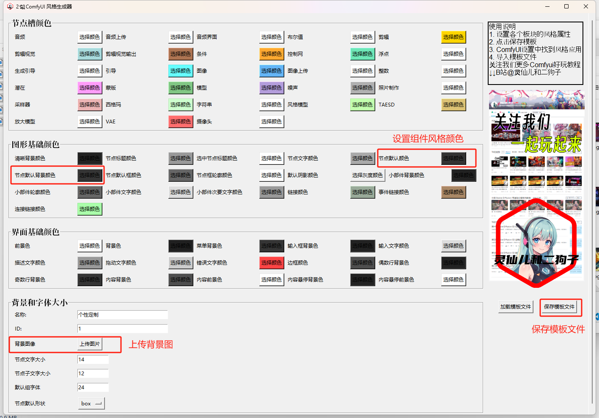
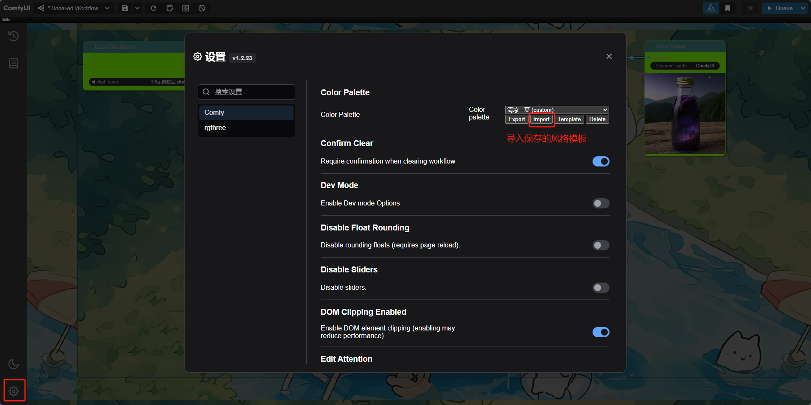
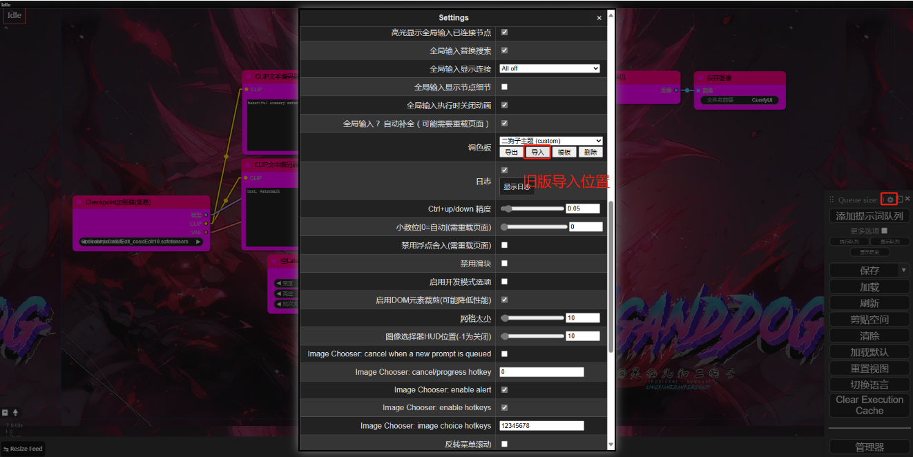
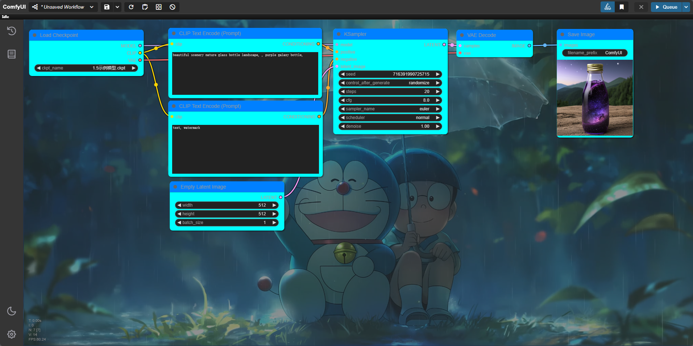
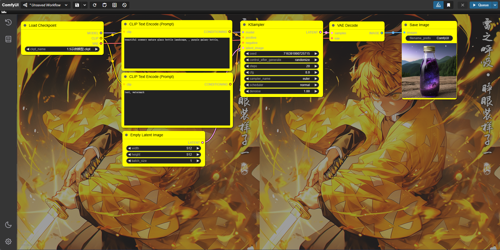
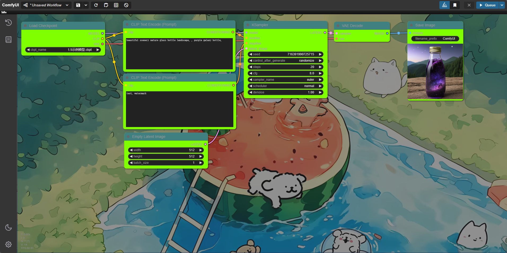
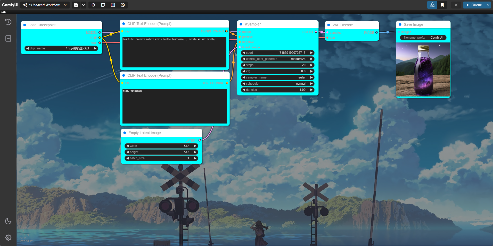
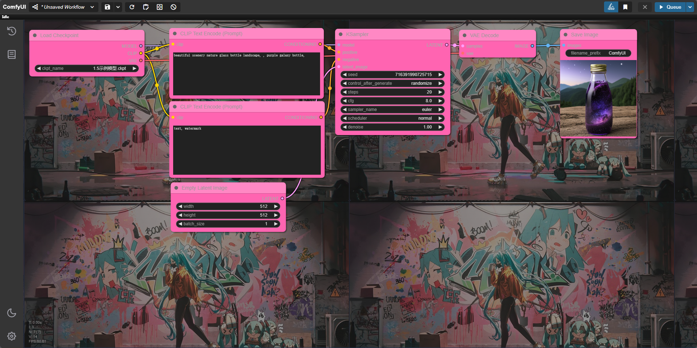
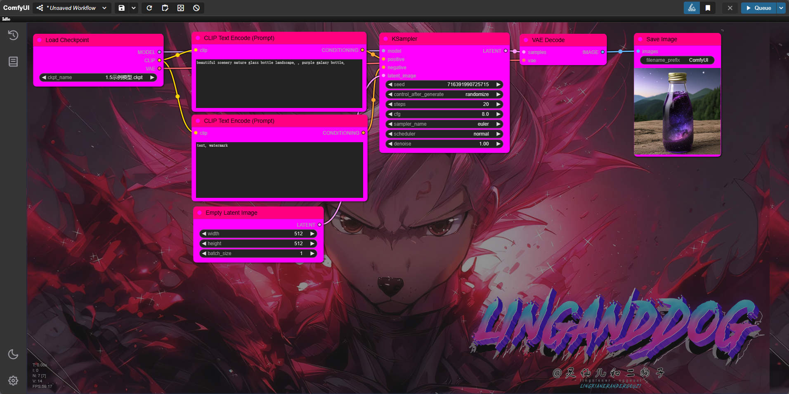

    
哈喽！我是二狗子（2🐕）！这是一套针对Comfyui玩家制作的界面主题风格一键定制机    

## 使用说明    
     
启动程序后根据需求设置每个板块的主题保存后得到json的风格模板    

## 应用方式     
     
新版导入入口    

         
旧版导入入口    

## 风格示例    
    
    
    
    
    
    

## 更多SD免费教程
More SD free tutorials   
灵仙儿和二狗子的Bilibili空间，欢迎访问：   
Bilibili space for Lingxian'er and Ergouzi, welcome to visit:   
[灵仙儿二狗子的Bilibili空间](https://space.bilibili.com/19723588?spm_id_from=333.1007.0.0)   
欢迎加入我们的QQ频道，点击这里进入：   
Welcome to our QQ channel, click here to enter:   
[二狗子的QQ频道](https://pd.qq.com/s/3d9ys5wpr)   
 

